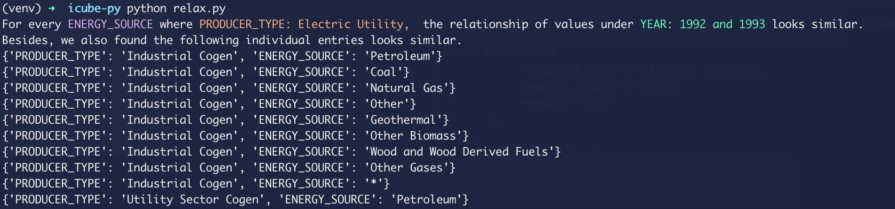
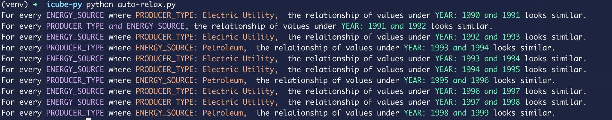

# icube-relax-python
Unofficial python implementation of icube-relax [SIGMOD'00]

This is an unofficial implementation of the RELAX operator proposed by Sunita Sarawagi et al. in "i3: intelligent, interactive investigation of OLAP data cubes". You can refer [https://www.cse.iitb.ac.in/~sunita/icube/](https://www.cse.iitb.ac.in/~sunita/icube/) for official implementation.


```
@article{sarawagi2000i3,
  title={i3: intelligent, interactive investigation of OLAP data cubes},
  author={Sarawagi, Sunita and Sathe, Gayatri},
  journal={ACM SIGMOD Record},
  volume={29},
  number={2},
  pages={589},
  year={2000},
  publisher={ACM New York, NY, USA}
}
```

## Instruction

The implementation is based on MySQL. However, the query interface can be easily extended to other databases as we decompose many nested queries in the official implementation. The implementation only accepts one table for RELAX operator. You may construct a database view in case you need to link multiple tables.

You need to install MySQL and necessary python packages (```pip install -r requirements.txt```). Then, you need to modify ```spec.json``` based on your analytical tasks.

```
{
    "hostname": "localhost", // MySQL hostname
    "username": "root", // MySQL username
    "passwd": "123456", // MySQL password
    "database": "icube", // MySQL database name
    "table": "so2", // MySQL table/view name
    "measure":"SUM(SO2__KT_)", // desired measure
    "subspaces": [ // a pair of targeted subspace
        {
            "PRODUCER_TYPE": "Electric Utility", 
            "ENERGY_SOURCE": "Coal", 
            "YEAR": "1992"
        },
        {
            "PRODUCER_TYPE": "Electric Utility", 
            "ENERGY_SOURCE": "Coal", 
            "YEAR": "1993"
        }
    ],
    "auto_cube_batch": {
        "PRODUCER_TYPE": "ALL", // Run RELAX on ALL possible value of "PRODUCER_TYPE"
        "ENERGY_SOURCE": ["Coal", "Petroleum"] // Run RELAX only on the cell where "PRODUCER_TYPE" is within "Coal" and "Petroleum"
    },
    "auto_target_col": "YEAR", // make comparison on "YEAR"
    "auto_target_batch_type": "int-inc", // construct comparison pair incrementally, e.g., (1990, 1991), (1991, 1992), ..., (2014, 2015)
    "auto_target_pair": [

    ], // manually specify interesting comparison pairs
    "threshold": 0.1, // threshold for generalization
    "topk": 10, // maximal allowed output results
    "max_exception": 1 // maximal allowed exceptions in each commonness

}
```

Run ```python relax.py``` and it will output a list of common subspaces. For example,




Run ```python auto-relax.py``` and it will output a list of common high-level subspaces on multiple comparison pairs (note that single common cell will not be listed in ```auto``` mode). For example,


